# FrameScope


> Rootless Android performance overlay featuring live FPS metering, thermal diagnostics, and privileged gaming optimization via Shizuku.

> **Fork note:** FrameScope is a derivative of the MIT-licensed [FrameX-Android](https://github.com/MaheshSharan/FrameX-Android). This fork renames the application and adds an Android 8.1-compatible foreground-layer FPS reader based on `SurfaceFlinger --latency`.

<p align="center">
  <a href="https://github.com/superj0107/FrameScope/releases/latest">
    
  </a>
  <a href="https://github.com/superj0107/FrameScope/releases/tag/v0.1.0">
    
  </a>
  <a href="https://developer.android.com/about/versions/oreo">
    
  </a>
  <a href="https://kotlinlang.org">
    
  </a>
  <a href="LICENSE">
    
  </a>
</p>

---
>  [!NOTE]
> **Gaming Performance Mode** is optimized specifically for **Android 16** and **Vivo OriginOS/FuntouchOS** devices (featuring hardware Mode 4 1080p @ 120Hz lock and 4 OEM Whitelists engine). For Vivo devices, enable **Vivo T3 Ultra Hardware Optimizations** in Settings (About) to unlock maximum gaming performance. Behavior on other Android skins may vary.

> [!IMPORTANT]
> **Encountering "Parse Failed" or "Unsupported Hardware"?**
>
> If thermal monitoring displays **"Parse Failed"** or **"Unsupported Hardware"** on your device:
> 1. Clone the repository and install the **Debug APK** (`./gradlew installDebug`). *(Release builds strip diagnostic logs via ProGuard).*
> 2. Open the **Thermal Diagnostics** screen in FrameScope.
> 3. Run the following ADB commands to capture complete diagnostics:
>    ```bash
>    # 1. Capture FrameScope internal thermal logs
>    adb logcat -d | grep -E "ThermalMonitor|CmdRunner"
>
>    # 2. Capture raw system thermal HAL dump
>    adb shell dumpsys thermalservice
>
>    # 3. Capture sysfs thermal zones (if dumpsys is empty/HAL Ready: false)
>    adb shell "for z in /sys/class/thermal/thermal_zone*; do echo \"\$(cat \$z/type 2>/dev/null):\$(cat \$z/temp 2>/dev/null)\"; done"
>    ```
>    *(On Windows PowerShell for Step 1: `adb logcat -d | Select-String -Pattern "ThermalMonitor|CmdRunner"`)*
> 4. Open a GitHub Issue attaching the outputs above along with your **device model**, **SoC**, and **Android/ROM version**.

---
## What it does

FrameScope displays a fully customizable, low-overhead overlay on top of any application or full-screen title.

| Category | Telemetry & Features |
| :--- | :--- |
| **Real-Time Telemetry** | **FPS** · **CPU Frequencies** · **Thermals** *(CPU/GPU/Skin/NPU/Battery)* · **RAM Usage** · **Network Speed** · **Ping** |
| **System Optimization** | • **Crash-Safe Snapshots:** Automatic pre-game setting capture & auto-revert on exit<br>• **Process Management:** Background app suspension & Doze CPU whitelisting<br>• **Emergency Safety:** One-swipe reset slider to purge overrides back to stock OS defaults |
| **OEM Hardware Locks** | • **Vivo OriginOS Engine:** Forces hardware Mode 4 ($1080 \times 2400$ @ 120Hz) lock<br>• **Triple Whitelisting:** Automatic injection across 4 native OriginOS game-booster daemons |

---

## Requirements

- Android 8.0 (API 26) or higher
- [Shizuku](https://github.com/RikkaApps/Shizuku) installed and running
- Activate via Wireless Debugging (no PC needed on Android 11+) or ADB
- Works with the Sui module on rooted devices

---

## Screenshots

<table>
  <tr>
    <td align="center">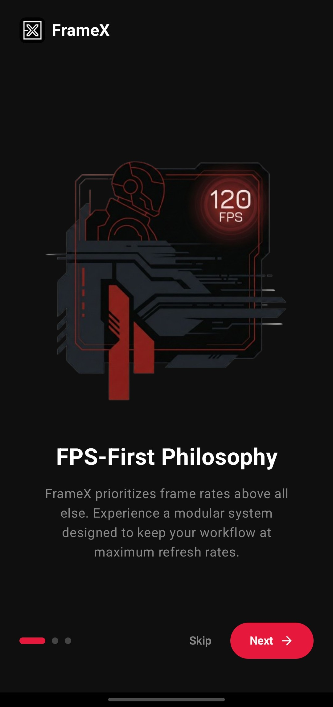<br/><sub><b>Onboarding 1</b></sub></td>
    <td align="center">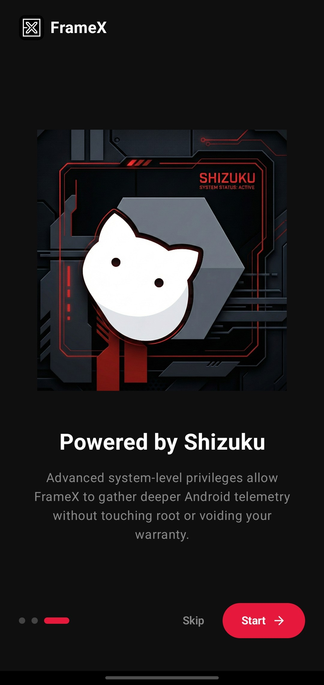<br/><sub><b>Onboarding 2</b></sub></td>
    <td align="center">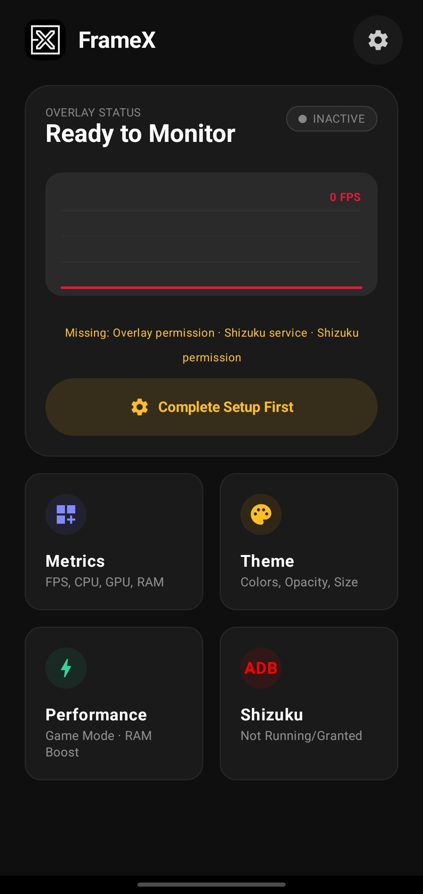<br/><sub><b>Dashboard (No Setup)</b></sub></td>
    <td align="center">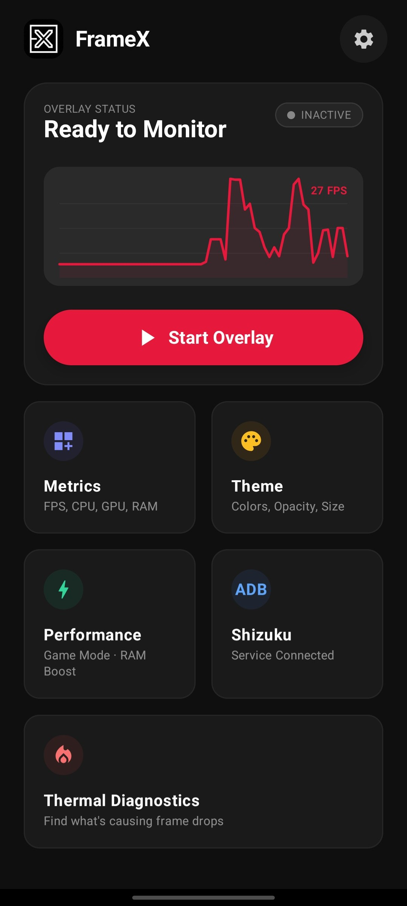<br/><sub><b>Dashboard (Running)</b></sub></td>
    <td align="center">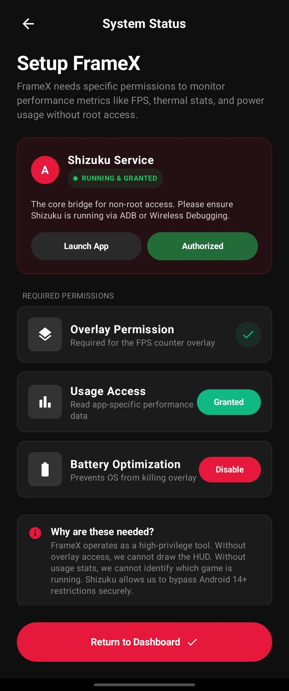<br/><sub><b>System Setup</b></sub></td>
  </tr>
  <tr>
    <td align="center">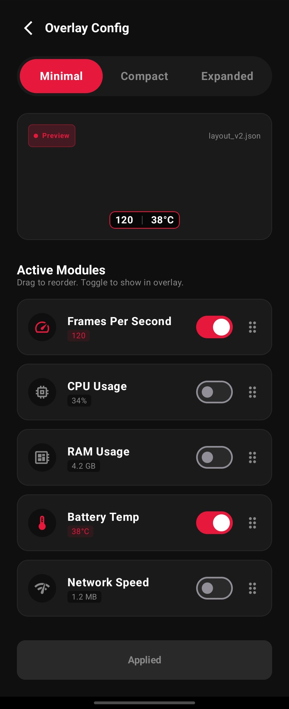<br/><sub><b>Overlay Config</b></sub></td>
    <td align="center">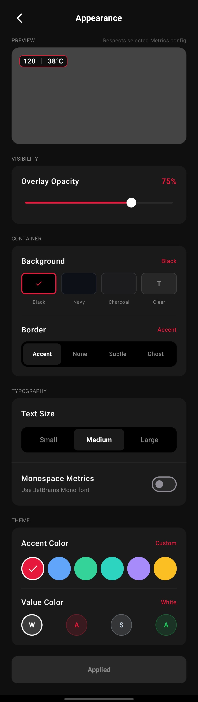<br/><sub><b>Appearance Settings</b></sub></td>
    <td align="center">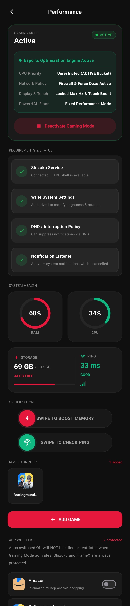<br/><sub><b>Performance Mode</b></sub></td>
    <td align="center">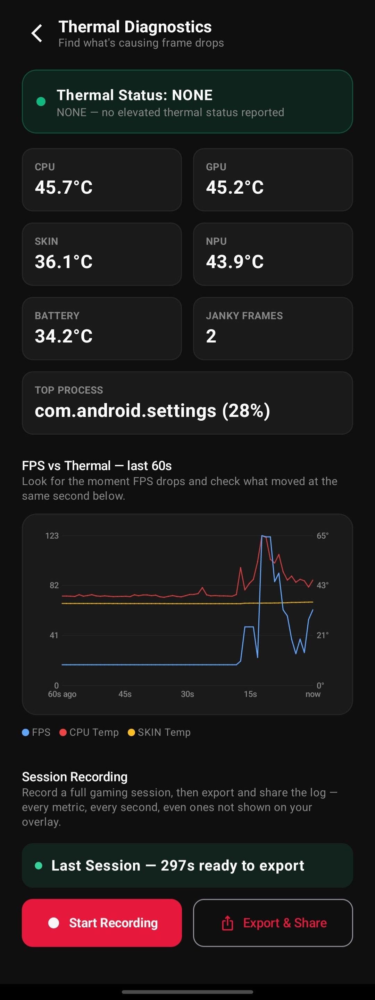<br/><sub><b>Thermal Diagnostics</b></sub></td>
    <td align="center">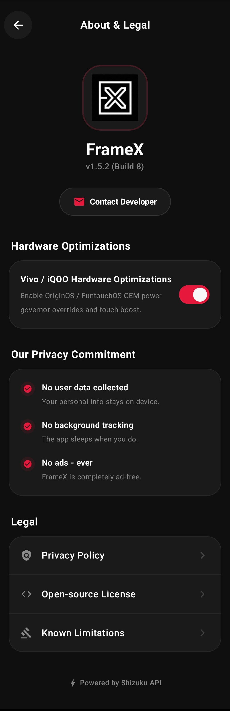<br/><sub><b>About & Legal</b></sub></td>
  </tr>
</table>

---

## How FPS is measured

FrameScope measures frame rates directly at the Android OS compositor layer using privileged IPC calls to `SurfaceFlinger --latency`. On Android 8.1 devices that do not expose the newer `--timestats` fields, it reads the foreground layer's presented-frame timestamps instead. Because telemetry is gathered directly from the display pipeline, it adds **zero overhead** to the monitored app's rendering threads or GPU pipeline.

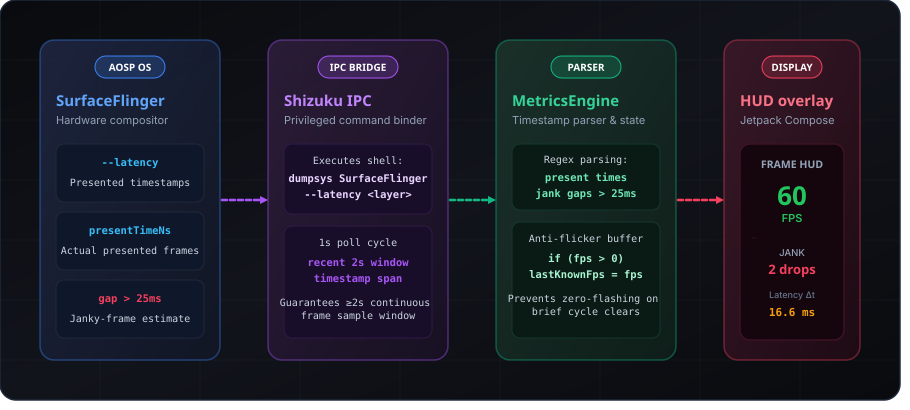

---

## Build

Standard Android Gradle project. Requires **JDK 17** and **Android SDK 34**.

```bash
git clone https://github.com/superj0107/FrameScope.git
cd FrameScope-Android
./gradlew assembleDebug
```

## Download the tested APK

The repository includes the debug APK tested on an Android 8.1 watch:

- [FrameScope_v0.1.0-debug.apk](releases/FrameScope_v0.1.0-debug.apk)
- Package: `com.framescope.app`
- Minimum Android version: Android 8.0 (API 26)
- The FPS overlay requires Shizuku and the draw-over-other-apps permission.


---

## Permissions

| Permission | Why |
|---|---|
| Draw over other apps | Display the overlay on top of games |
| Foreground service | Keep the overlay alive while the screen is on |
| Wake lock | Prevent CPU sleep during an active session |
| PACKAGE_USAGE_STATS | Identify which game is in the foreground |
| REQUEST_IGNORE_BATTERY_OPTIMIZATIONS | Survive aggressive OEM background-kill policies |
| Receive boot completed | Auto-restart overlay after reboot if it was active |
| Internet | Ping measurement to `8.8.8.8` (Google Public DNS) only |
| Kill background processes | Used to purge cached background apps during Gaming Mode activation |
| Access notification policy | Required to toggle Do Not Disturb mode automatically |
| Modify system settings | Required to deploy per-game brightness, volume, and rotation overrides |
| Foreground service (Special Use) | Ensures Gaming Mode stays active on Android 14+ |
| Post Notifications (Android 13+) | Display session status & quick-control notification controls |
| QUERY_ALL_PACKAGES | Load installed games and apps for Game Launcher optimization |
| Shizuku Privileged API | High-precision FPS metering (`SurfaceFlinger`), multi-sensor thermal diagnostics (`IThermalService`), ART RAM heap compaction, and OriginOS Esports hardware engine |

---

## Security & Privacy

- **No data collection** — nothing is sent anywhere
- **No analytics** — no Firebase, no Crashlytics, no tracking SDKs
- **No accounts** — FrameScope has no sign-in or user identity
- **No ads** — ever
- All data stays on-device

[Full Privacy Policy](https://superj0107.github.io/FrameScope/privacy-policy)

---

## Known Limitations

A small number of metrics depend on data some device vendors don't expose. See [KNOWN_LIMITATIONS.md](KNOWN_LIMITATIONS.md) for confirmed cases and affected devices.

---

## Credits

- [Shizuku](https://github.com/RikkaApps/Shizuku) by [RikkaW](https://github.com/RikkaApps) — the privileged API bridge that makes rootless system access possible. FrameScope would not exist without it.

---

## License

This project is licensed under the MIT License - see the [LICENSE](LICENSE) file for details.
